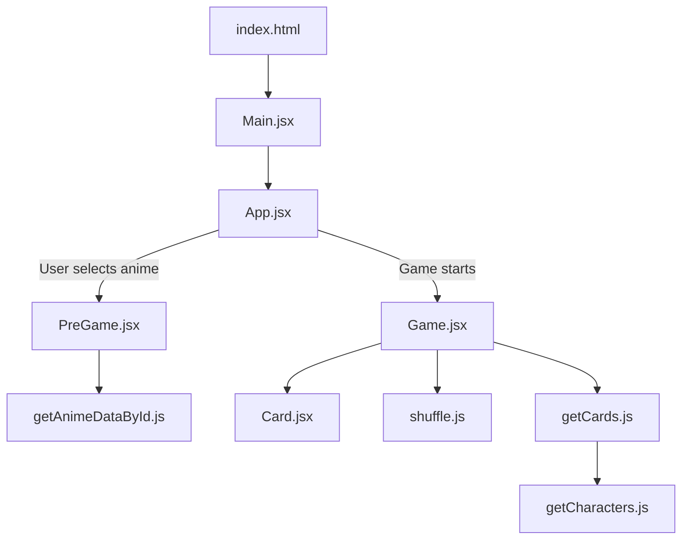

# Anime Memory
[](https://app.netlify.com/sites/anime-memory/deploys)

Developed an anime memory card [game](https://anime-memory.netlify.app/) as a result of this [project](https://www.theodinproject.com/lessons/react-new-memory-card). Integrated [Jikan API](https://jikan.moe/), a free API. Unique feature of choosing any anime from MyAnimeList site using its id.

## Run Locally
To run the project on your machine, follow these steps:

### Prerequisites
- [Node.js](https://nodejs.org/) and npm installed.

### Steps
1. Clone the repository:
    ```bash
    git clone git@github.com:MclPio/memory_card.git
    cd memory_card
    ```

2. Install dependencies:
    ```bash
    npm install
    ```

3. Run the server:
    ```bash
    npm run dev
    ```

4. Open your browser to http://localhost:5173/

## Code Overview

The project follows a modular React structure. Below is a diagram of the main components and their relationships:


